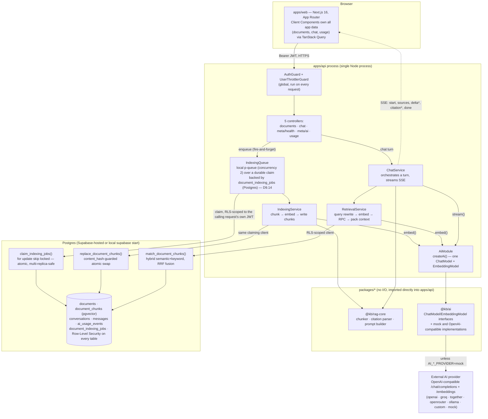

# Architecture

A from-the-code description of how this app is actually built, not how a
generic RAG app might be built. Every claim here is sourced from a specific
file; where something doesn't exist (a background worker independent of a
live request, a deploy target beyond "run the Dockerfiles somewhere"),
that's stated plainly rather than glossed over. See `docs/DECISIONS.md`
for the dated reasoning behind each of these choices.

## System diagram

Two things the diagram compresses that matter: `IndexingQueue`'s *local*
concurrency limiter lives **inside** the same `apps/api` process that
serves HTTP requests — there is no separate worker process — while the
durable job state it claims from lives in Postgres, not in that process;
and every arrow into Postgres from `apps/api` carries the *calling user's
own JWT*, not a shared admin credential. Both are expanded below.

## Components

| Component | What it is | Owns |
|---|---|---|
| `apps/web` | Next.js 16 (App Router), deployed as a plain Node process (`next start`) or any Next-compatible host | UI; talks to `apps/api` over HTTP with a bearer token for every app-data request — it never queries Postgres directly |
| `apps/api` | NestJS 12 on Express, one process, default port `3001` | Auth verification, all business logic, all Postgres access, AI provider calls, the indexing queue |
| `packages/shared` | Zod schemas + inferred types, browser-safe (no secrets) | The request/response contract both apps import — a schema change is a single source of truth for both sides |
| `packages/ai` | Provider-agnostic `ChatModel`/`EmbeddingModel` interfaces | `createAi()`, the one place that decides mock vs. a real OpenAI-compatible provider from env vars |
| `packages/rag-core` | Pure functions, no I/O | Markdown-aware token chunker, the citation-marker stream parser, the chat prompt builder |
| Postgres (`supabase/migrations/*.sql`) | Supabase-hosted or a local `supabase start` — plain Postgres + the `vector` extension underneath | Data, Row-Level Security, and the two RPCs (`match_document_chunks`, `replace_document_chunks`) that do the actual retrieval/indexing work in SQL |

`apps/web` depends only on `@kb/shared` — it has no dependency on `@kb/ai`
or `@kb/rag-core` at all, confirming the AI/RAG logic is entirely
server-side.

## Request flow: saving a document → indexing

1. The document form (`apps/web/src/features/documents/components/document-form.tsx`)
   calls `useSaveDocument()`, which `POST`s or `PATCH`es `/documents` with a
   bearer token from the browser's Supabase session.
2. `DocumentsController` validates the body with a Zod schema and calls
   `DocumentsService`. The `documents` row itself — title, content, tags,
   a freshly computed `content_hash` (`sha256(title + "\0" + content)`,
   deliberately excluding tags so a tags-only edit doesn't re-trigger
   indexing) — is written **synchronously**, in the request/response cycle.
   The response returns immediately with `indexStatus: "pending"`.
3. Only if the content hash actually changed does `DocumentsService` call
   `IndexingQueue.enqueue({ documentId, contentHash, userJwt })` —
   fire-and-forget, not awaited by the HTTP response.
4. Updated (D9.14): `enqueue()` first durably **upserts** a row into
   `document_indexing_jobs` (`supabase/migrations/*_document_indexing_jobs.sql`),
   keyed by `document_id` — a document saved again while it already has a
   job outstanding replaces that row rather than queuing a second one, the
   same "latest job wins" guarantee as before, now surviving a process
   restart instead of living only in memory. It then best-effort kicks a
   local claim attempt: `IndexingQueue`'s own `p-queue` (**concurrency 2**,
   unchanged from Phase 4) bounds how much of *this* work this one process
   does at once, but the actual claim — `claim_indexing_jobs`, `for update
   skip locked` — is what's authoritative and multi-replica-safe; a second
   `apps/api` replica racing to claim the same row simply gets nothing back.
5. `IndexingService.process(db, job)` takes the **already-scoped client the
   claim itself ran as** (the request that triggered the claim's own live
   JWT — never a JWT read back out of storage; see `docs/DECISIONS.md`
   D9.14 for why one was never persisted in the first place), marks the
   document `indexing`, and calls the real pipeline: `chunkDocument()`
   (`@kb/rag-core`, defaults 450 target / 600 max / 60 overlap tokens) →
   `embeddingModel.embed()` (`@kb/ai`) → the `replace_document_chunks` RPC.
6. `replace_document_chunks` is the correctness guard: it row-locks the
   document, compares the caller-supplied `content_hash` against the
   document's *current* one, and silently declines (returns `false`, not an
   error) if a newer save has already superseded this job — so two
   overlapping indexing runs for the same document can never race each
   other's writes. On success it atomically replaces every chunk and flips
   `index_status` to `ready`.
7. The frontend has no push channel for this — it discovers `ready`/`failed`
   purely by polling `GET /documents`/`GET /documents/:id` while a row is
   `pending`/`indexing`.

## Request flow: asking a chat question → streaming answer

1. `useChatStream()` posts to `/chat/stream` and reads the response body as
   a raw SSE stream (manually parsed on `\n\n` frame boundaries, not the
   browser's `EventSource` API, since that doesn't support custom headers).
2. `ChatController.stream()` writes SSE headers and flushes them before
   anything else, attaches a 15-second heartbeat comment so idle proxies
   don't time the connection out, and wires the client's disconnect
   (`res.on("close")`) to an `AbortController` that's threaded all the way
   down into the LLM call.
3. `ChatService.runTurn()` — the **same orchestration function** backs both
   `/chat/stream` (SSE) and `/chat` (a plain JSON, all-at-once response) —
   loads conversation history, persists a user message and an assistant
   placeholder, and calls `RetrievalService.retrieve()`.
4. `RetrievalService`: optionally rewrites the query using recent history
   (only when there *is* prior history — a fresh question is never
   rewritten, and a rewrite failure/timeout silently falls back to the raw
   question rather than blocking retrieval), embeds it, calls
   `match_document_chunks` (hybrid semantic + keyword, fused with
   reciprocal rank fusion — see `docs/DECISIONS.md` for why RRF over a
   weighted score), merges overlap-adjacent chunks back into clean spans
   re-sliced against the document's *current* content, and greedily packs
   the result into a token budget (`RAG_CONTEXT_TOKENS`, default 3500).
5. If retrieval finds nothing, the turn ends immediately with a fixed
   "couldn't find this in your documents" message — no LLM call happens and
   no usage is recorded for that turn.
6. Otherwise `ChatService.streamAnswer()` builds the prompt (`@kb/rag-core`)
   and iterates `chatModel.stream()`. Every delta is pushed through a
   citation-marker stream parser that recognizes `[S1]`-style markers even
   when a marker is split across two stream chunks, and only lets a
   citation through if it names a source id retrieval actually returned —
   a hallucinated citation id is silently dropped from what's shown, not
   corrected or fabricated.
7. On completion, the final answer, its citations (with document id,
   snippet, and the exact char range for the "open in document" deep link),
   and token usage are all persisted, and a `done` event closes the stream.
   A client-initiated abort ends the same way — `finishReason: "aborted"`
   — not as an error.

## Auth boundary

Every request except `GET /health` and `GET /meta/ai` passes through a
global `AuthGuard`. It expects `Authorization: Bearer <jwt>` and verifies it
one of two ways: in production, via Supabase's `getClaims()` against the
project's real JWKS; in any non-production environment, via a hand-rolled
HS256 check against the well-known local `supabase start` secret — a path
that is **architecturally unreachable** when `NODE_ENV=production`, not just
conventionally avoided. Either path additionally rejects any token whose
`role` claim isn't exactly `"authenticated"`, so a leaked `service_role`
token can't be used to call the API as if it were a user.

Once verified, the guard builds a Postgres client scoped to *that exact
JWT* and attaches it to the request. Every repository in the app —
including the indexing pipeline, which always runs as whichever live
request's client actually performed the claim (D9.14; never a stored
credential — `document_indexing_jobs` holds no JWT/credential column at
all) — takes this per-request client as a parameter. **There is no
service-role client anywhere in `apps/api`**, enforced by both code review
and a standing regression test (`apps/api/src/no-service-role-key.spec.ts`).
Every table's Row-Level Security policy compares `user_id` against
`auth.uid()`, so isolation between users is a database-level guarantee, not
an application-level one that a controller bug could bypass.

## Background and asynchronous work

- **`IndexingQueue`** — covered above. Updated (D9.14): the durable job
  state (`document_indexing_jobs`) lives in Postgres, not in this process,
  and claiming it (`claim_indexing_jobs`) is atomic and multi-replica-safe.
  What's still in-process is only a *local* concurrency limiter (`p-queue`,
  concurrency 2) over however many of the caller's own claimed jobs this
  one process works on at a time — not a correctness assumption anymore,
  just a per-replica throughput cap. See `docs/SCALING.md` item 1.
- **Crash recovery, but still no boot-time sweep.** Because every query runs
  under RLS as a specific user's JWT, there's no way to run a global
  "resume every stuck job" sweep at process startup — there's no user
  context to run it as, and using a service-role client to bypass that was
  deliberately rejected (same reasoning as the auth boundary above). Instead,
  `DocumentsService` runs this sweep lazily and scoped to the caller, on
  every `GET /documents`/`GET /documents/:id` call: it calls
  `IndexingQueue.kick(auth.db, 2)`, which claims (from the durable table,
  not by re-deriving stuck-ness from `documents.index_status` the way it
  used to) up to 2 of that user's own pending or stale-`processing` jobs
  and processes them with the caller's own current JWT. The documented gap
  is unchanged by D9.14 and can't structurally be closed without a
  service-role client: a document whose owner never makes another request
  stays stuck until they do — what D9.14 fixes is that the job is
  guaranteed to still be there, correctly claimable, and that two replicas
  can no longer both grab it. See `docs/DECISIONS.md` D9.14.
- **No cron, no scheduled jobs, anywhere.** Confirmed by grep — no
  `@Cron`/`@Interval`/`ScheduleModule` usage in `apps/api`, no external
  scheduler config in the repo. The only recurring timer in the whole
  system is the per-connection 15-second SSE heartbeat.

## External dependencies

- **Postgres**: either a hosted Supabase project or a local
  `supabase start` (Docker-backed) — see the README's "Hosted Supabase"
  section for running the same migrations by hand against a hosted project.
  The schema itself is plain Postgres + `pgvector`; what actually ties it to
  Supabase specifically is the auth model (`auth.users`/`auth.uid()`/JWTs
  issued by Supabase Auth), not the data layer.
- **AI providers**: `createAi()` in `@kb/ai` is the single place provider
  choice is decided, purely from environment variables
  (`AI_CHAT_PROVIDER`/`AI_EMBEDDING_PROVIDER`). Supported presets: `openai`,
  `groq` (chat only — no embeddings endpoint), `together`, `openrouter`,
  `ollama`, `custom` (any OpenAI-compatible base URL), and `mock` (the
  default — keyless, deterministic, zero cost). Embedding dimensions are
  hard-pinned to 1536 to match the `document_chunks.embedding` column width.
- **Rate limiting**: `@nestjs/throttler`, two buckets — `default`
  (120 requests/60s) for everything, `chat` (20 requests/60s) specifically
  for `POST /chat` and `POST /chat/stream`, both keyed per authenticated
  user (falling back to IP for the two public routes). See
  `docs/SCALING.md` for why this matters once `apps/api` runs as more than
  one process.

## Deployment shape as it exists today

Updated (D9.13, Phase 9): `apps/api/Dockerfile` and `apps/web/Dockerfile`
(multi-stage, `turbo prune --docker` based) build a production image for
each app, and `.github/workflows/ci.yml` runs typecheck/lint/unit tests,
both e2e suites (Gate 3 against a real Postgres service container, Gate 6
against real Chromium), and a build of both images on every push/PR to
`main`. See `docs/DEPLOYMENT.md` for how to actually run the images and
`docs/DECISIONS.md` D9.13 for what was and wasn't possible to verify live
before this landed. There is still no `vercel.json`, no `fly.toml`, no
Kubernetes manifests, and no host this is actually deployed to — the
images exist and build; nothing runs them anywhere yet.

Both apps are plain, independently runnable Node processes —
`apps/api` via `nest build && node dist/main` (`npm run start:prod`, what
its Dockerfile's image runs), `apps/web` via `next build`'s standalone
output (`node server.js`, what its Dockerfile's image runs) — and now
there's a documented, buildable way to package each one, but still nothing
that automates actually deploying either image anywhere. If this were
deployed today, the minimum set of running pieces would be: one or more
`apps/api` containers/processes (updated, D9.14: running more than one is
no longer a correctness hazard — `document_indexing_jobs` and
`claim_indexing_jobs` make indexing safe across replicas, see
`docs/DECISIONS.md` D9.14 and `docs/SCALING.md` item 1 — though there is
still no orchestrator config here that actually runs more than one), one
long-running `apps/web` container/process, and a reachable Postgres
+pgvector instance with Supabase Auth in front of it (a hosted Supabase
project — nothing here packages or deploys Postgres itself). There is
still no background worker independent of a live request, no cron runner,
and no secrets-management system beyond environment variables passed to
each container directly (a real deployment's own mechanism — platform env
vars, a secrets manager — not something this repo provides); that remains
genuinely unaddressed, not merely undocumented.
